# OpenGL_GameDemo
使用OpenGL制作的一个游戏小Demo

## 设计思路:

1. 虚拟场景：沙漠、风车、地球表面等。(可以更换场景)
2. 虚拟物体：机器人、雪人、
3. 纹理贴图：利用skybox的概念，为地面、天空和四周的墙壁贴上一套图共6张，让场景更真实，为正方形贴图。
4. 光照、材质、阴影：机器人使用光照模型，实现Phong光照模型，设定机器人的材质属性，实现阴影效果。
5. 对场景的任意浏览：设计为通过摄像机视角的变化去观察整个场景，包括拉远拉进视角、左右旋转视角、上下旋转视角。还可以通过机器人的第一视角行走去观察整个场景。
6. 通过交互控制物体：设计为可控制机器人进行第一视角和第三视角的行走，并且行走时会自动做出类似人类行走时的肢体动作。

## 实现

### 天空盒

使用天空盒样例：

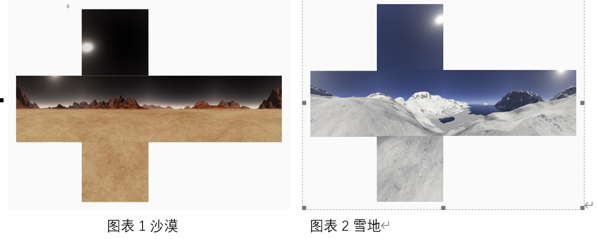

场景贴图效果：

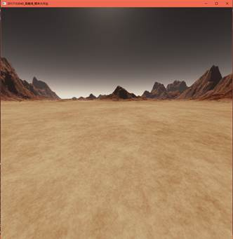

### 导入人物模型

机器人的层级模型

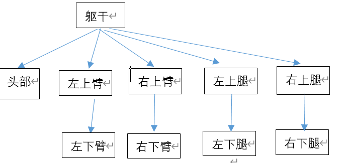

初步实现：

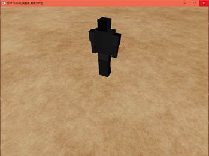

附上颜色：

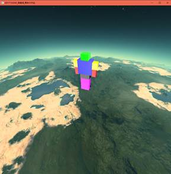

添加材质光照：

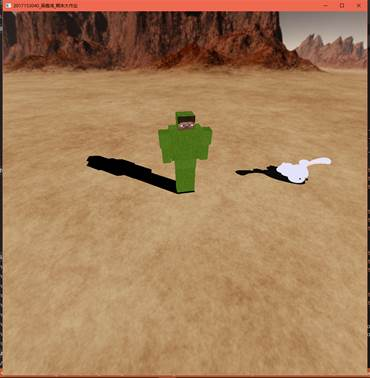

添加键盘鼠标操作移动事件：

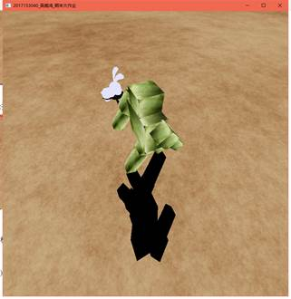

### 加入相机键盘鼠标操作最终的效果如下：

1. 相机操作

‘w’：视角向上                ‘s‘：视角向下

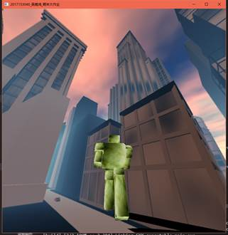 

 

‘a’：镜头左转                ‘d’: 镜头右转

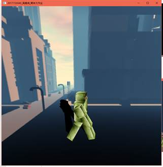 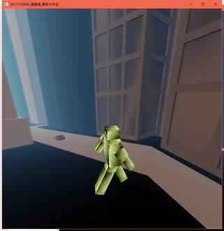

其他按键:

‘z’:视线距离变小；‘Z’视线距离变大‘x’:透视距离变远；’X‘透视距离变近

 

2. 机器人操作：

​    GLUT_UP_KEY机器人前进         GLUT_DOWN_KEY机器人后退

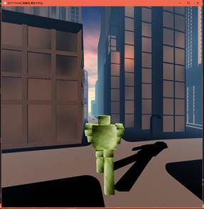     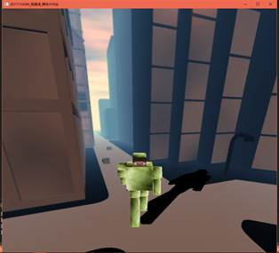

 

GLUT_LEFT_KEY机器人左转        GLUT_RIGHT_KEY机器人右转

 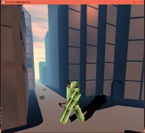     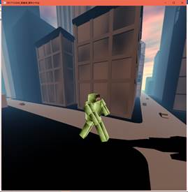

其他按键 : ‘Y’:开启跟随模式;’I’:进入上帝视角；‘u’机器人跳舞，‘*’相机到天空盒外部

 

**特殊操作**

‘f’:换脸

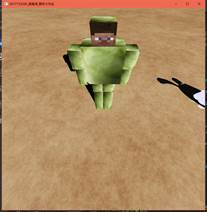 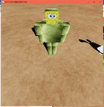 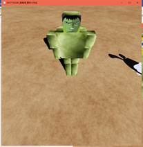

 

‘F’:换肤

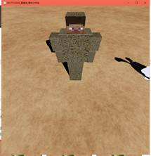 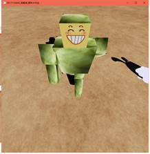 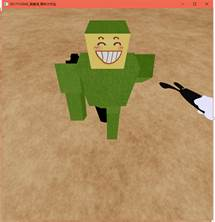

 

按下’t’进行场景的切换场景切换

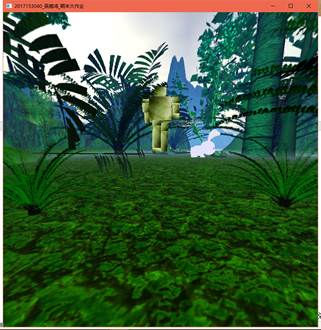 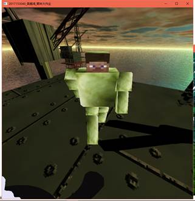

### 导入雪人

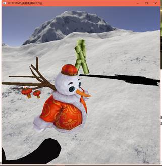 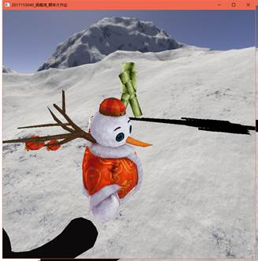

#### 一览：

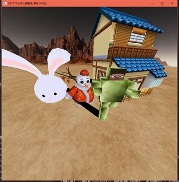

 

 